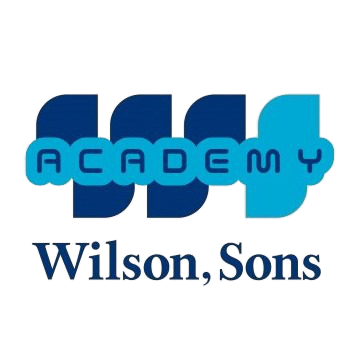
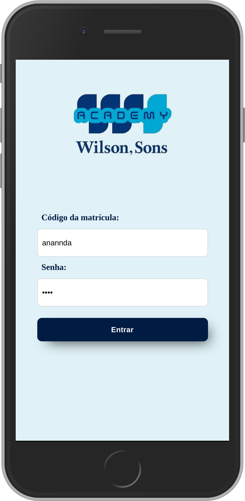

# WILSON, SONS ACADEMY. 

É uma plataforma off line desenvolvida como solução para o desafio da empresa Wilson, Sons que tem por objetivo transforma a experiência de treinamento dos funcionários embarcados, oferecendo assim um canal de aprendizado efetivo.

## Protótipo 

Inicialmente desenhamos soluções em papel, e após desenhamos alguma ideias no FIGMA.

 

## Custo do projeto 

## Tecnologias e Ferramentas Envolvidas

Desenvolvimento:

* HTML5
* JavaScript (ES6)
* CSS
* React Hooks
* Node.JS
* RASPBERRY PI (é um computador de baixo custo e que tem o tamanho de um cartão de crédito)
* REDE - MIKROTIKI 

Bibliotecas :
* Instascan 
* Jquery

## Ferramentas de Organização e Construção do projeto

* Trello
* Figma

***